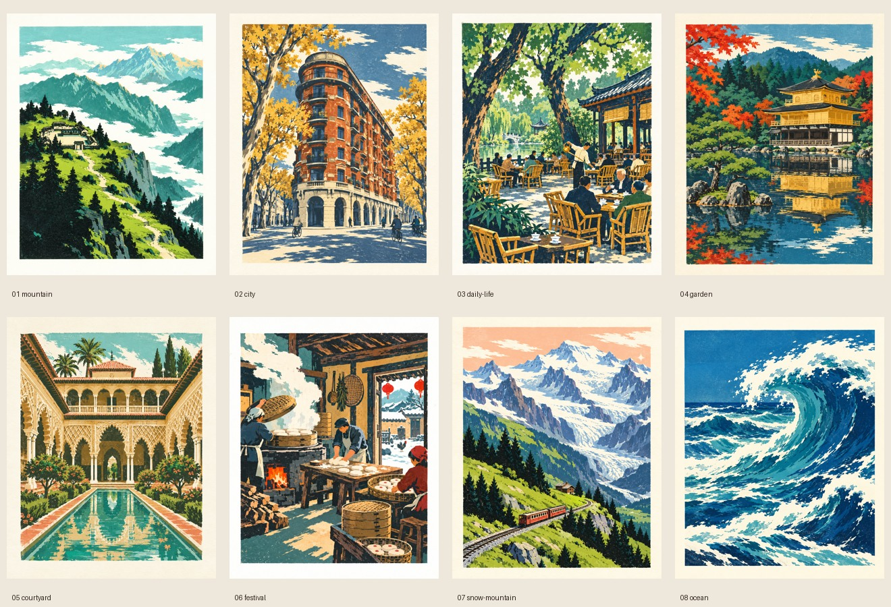

# 套色木刻 · 山河入版

将主题转为一幅可独立欣赏的彩色木刻印刷画。保留具体场景的可识别轮廓，用有限墨色、手刻形状和纸白组织画面。配色可以青绿、暖红、金黄、灰紫或深蓝，不把青绿色当成唯一风格。

## 必备视觉参考：先看图，再写提示词

**例图是本技能的必要组成部分，不能只读文字就开始作图。**

1. 用图像查看工具打开下方总览；它用于比较色块、景深和题材变化。
2. 从[例图索引](references/examples.md)选择至少两张单幅图并打开：一张最接近本次题材，一张补充另一种配色或构图。看清原尺寸例图的边缘与纹理，不能用总览替代单幅检查。
3. 简短记录本次要继承的色块关系、刀痕和景深，不复制例图中的具体景点、人物位置和构图。用户明确要求同景改绘时按其要求处理。

例图均为本项目的AI生成画作。原图来源、完整生成提示词和文件SHA256见[例图清单](references/examples.json)。参考路径相对本skill目录解析，不依赖本机旧项目路径或在线站点。若总览、索引或任一清单图片缺失，**先报告skill资源不完整并恢复资源，停止作图**；不能默默退化为无例图的文字风格包。工具无法查看图像时说明这一限制，不声称已参考例图。

## 风格骨架

- **以墨块造型**：较大的平涂色面互相嵌合。山石、叶丛、建筑和浪花由切割形状组成，避免连续渐变、真实镜头光照和光滑矢量描边。
- **刀痕有方向**：保留不规则硬边、细碎缺口、干墨露纸与局部刻线。刻线跟随岩脊、树枝、水流或建筑结构；不要把整张图盖上等密度随机噪点，也不要只在照片上叠纸纹。
- **纸白参与构图**：云、雪、水光、浪花、蒸汽和道路可以直接留出未印刷的暖白纸面。图像默认在干净的象牙白纸边内形成完整印刷矩形，纸边细而清楚，不做烧焦、破损或泛黄污渍效果。
- **有限墨色形成层次**：通常选4–7个主要墨色，暖白纸底不算一色。深色作为树木、屋檐或前景锚点，中间色组织主体，浅色与纸白拉开远景。轻微颗粒与套印不齐只作细节，不能造成重影或模糊地标。
- **景深由遮挡与明暗建立**：可选近景深色剪影、中景主要建筑或地形、远景较浅轮廓；庭院也可用门洞或廊柱框景。允许对称建筑构图、近景浪峰或横幅远眺，不强迫每幅都放一棵大树。
- **细节服从主形**：先确保天守、寺院、山峰等轮廓读得清，再加入简化的窗格、栏杆、枝叶与小人物。人物通常是比例参照或生活动作，不抢占整幅风景。

默认单幅竖向4:5、非透明背景、无文字无签名无水印。用户指定横幅、其他比例、文字或透明底时以其要求为准，保留墨色和刀痕关系即可。不要把“无文字”扩展成禁止画建筑、牌匾或节庆道具；可以保留其形状并让表面无字。

## 配色与主题

先选主体和视点，再选与季节、时间和气氛相符的墨色。参考[配色与提示词配方](references/prompt-recipes.md)，按色彩角色调整，不要求图像工具精确复现十六进制颜色。

- 山河、雪峰：青绿或冷蓝；也可使用灰紫与珊瑚晨光。
- 城市街景：砖红、金黄、蓝灰；夜景可用靛蓝与橙金。
- 园林与庭院：青绿、赭金、墨绿；秋季可用枫红、淡紫与金色。
- 人间生活与节庆：暖红、赭黄、深绿和米白；白色蒸汽保留纸面。
- 海浪：群青、青蓝、深靛与大片纸白；避免透明玻璃材质与摄影式水花。

真实地标选题先确认辨识结构，例如武康大楼的船形街角、金阁的层叠金色屋顶和池水、狮子庭院的石狮喷泉。必要时做简短可靠资料核对；不编造不存在的地标细节，也不把AI画面描述成实景记录。虚构主题不需要硬套真实地点。

## 作图与交付

使用当前环境可用的图像生成工具，遵循其参考图、尺寸与输出要求；内置image_gen可用时优先使用。若工具支持风格参考输入，所选例图仅作为STYLE参考，不作为待复制的画面。提示词描述真实可见的风格，不只写“像参考图”。工具不可用时可交付明确标注的提示词草案，不声称已生成图片。

提示词包括：题材与地标特征、视点和空间关系、墨色色彩角色、刀痕方向、纸白位置、纸边与画幅，以及应避免的视觉效果。先用[基础配方](references/prompt-recipes.md#基础配方)起草，再按本次例图观察调整。

批量任务先列清楚每张的主体、视点、时间或季节、配色和构图。相邻作品至少在其中两项上变化。按用户指定数量逐幅生成并保存独立文件；总览拼图不能算作多张原图。记录准确提示词与题材信息，交付前核对文件数量及是否有重复。只有用户要求网站、压缩包或发布时，才扩展到这些交付物。

每幅生成后实际查看：完整主体与纸边是否可见；墨块与刀痕是否成立；地标是否易辨认；颜色是否有主次；画面是否出现多余字样、摄影渐变或机械重复。针对实际问题修改提示词或编辑图像，不因追求完美反复无依据重做。保留已合格图片与用户已有资产。
