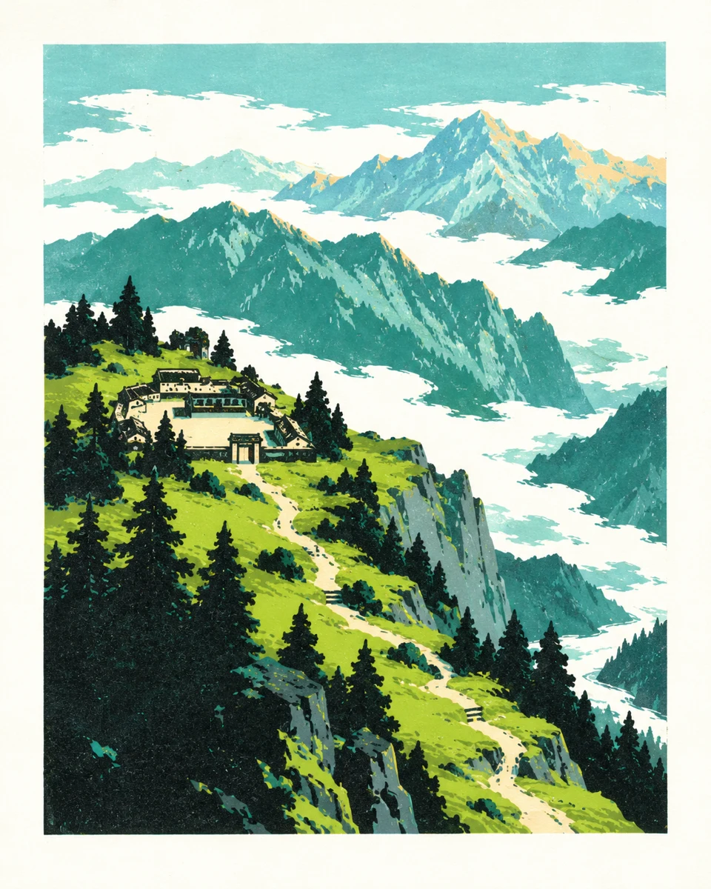
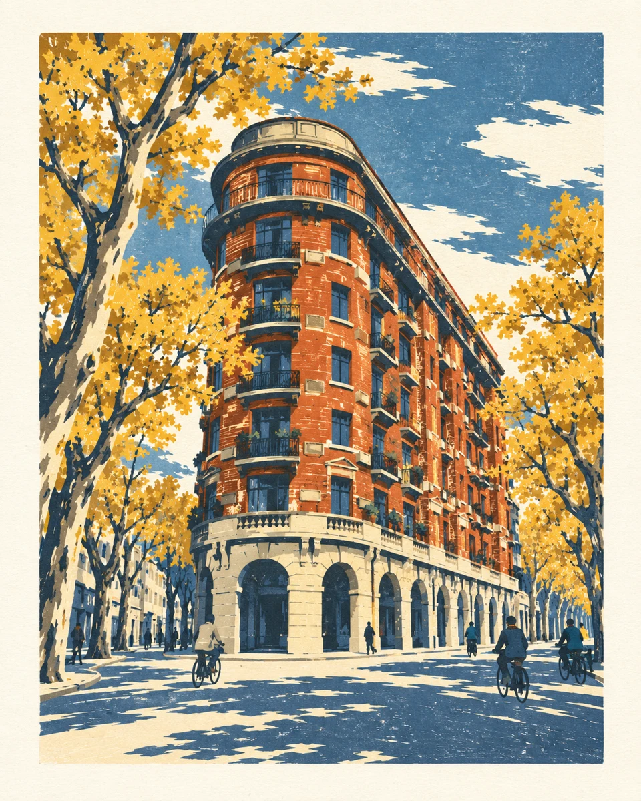
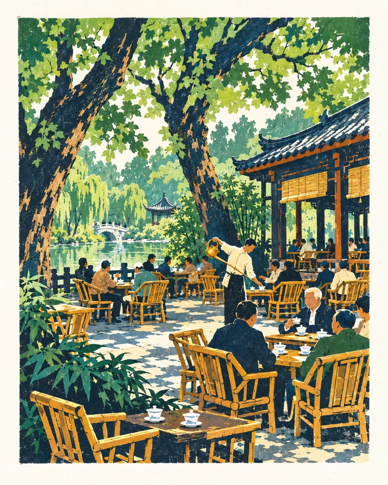
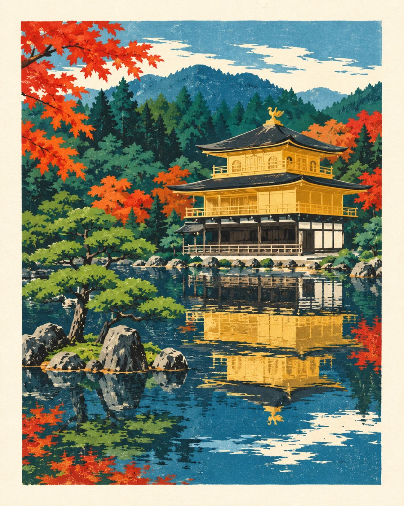
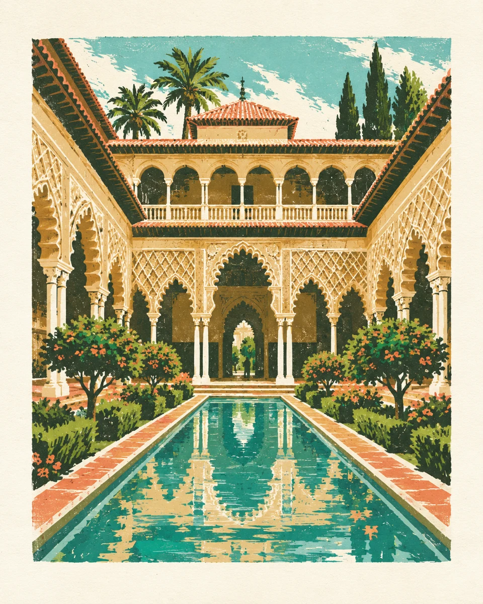
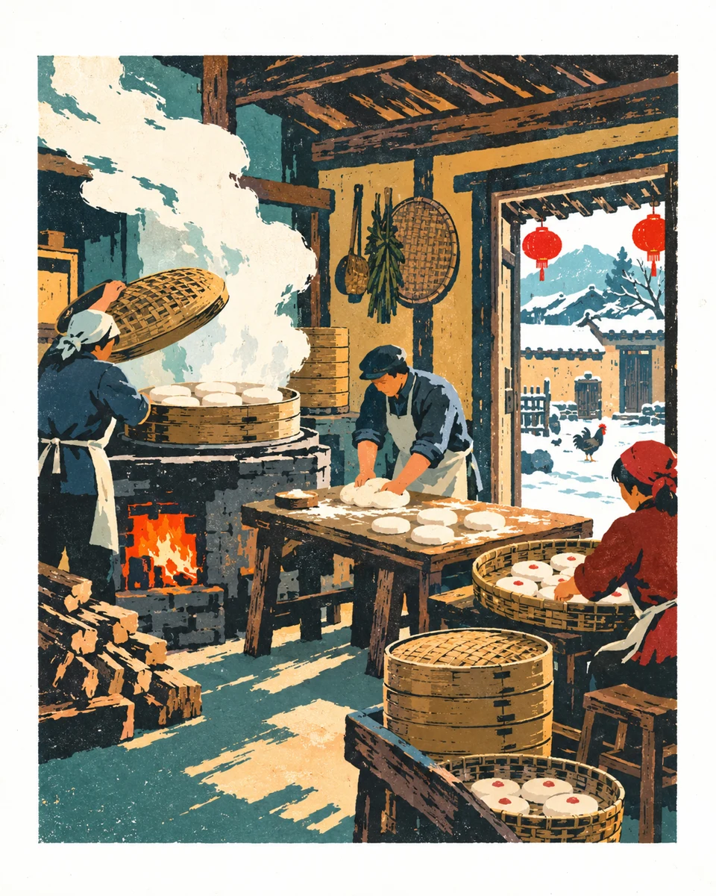
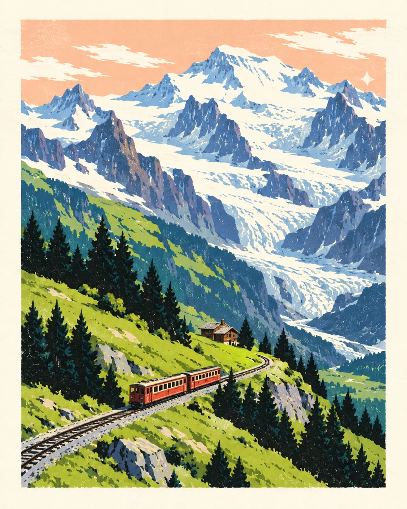
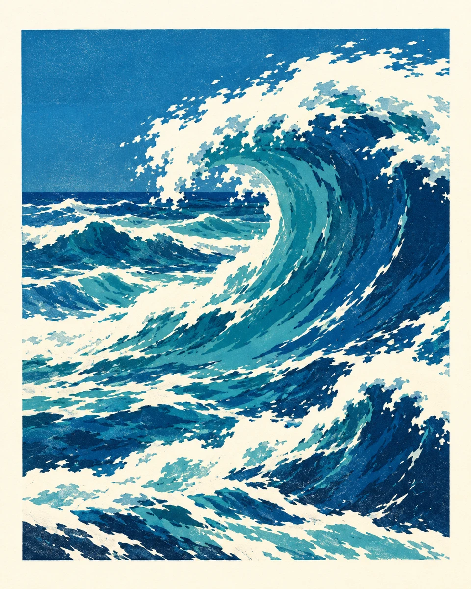

# 必备视觉例图

全部为山河入版项目中的AI生成作品，非实景摄影或历史原作。例图提取风格，不用于复制具体画面。完整生成提示词、来源路径和校验值见[examples.json](examples.json)。

## 云岭山院

青绿、深松绿、纸白云海；观察前景剪影和远近山体的层次。

## 上海 · 武康大楼

赭红砖墙、金黄梧桐、蓝灰街面；观察建筑轮廓与简化窗格。

## 成都 · 人民公园鹤鸣茶社

绿荫、竹椅赭黄、纸白光斑；观察小人物和生活动作如何融入大色块。

## 京都 · 金阁寺倒影

红枫、金阁、青蓝倒影；观察斜向树枝框景和静水留白。

## 塞维利亚 · 皇家城堡 · 庭院

赭金石墙、青绿水池、深绿棕榈；观察建筑透视与重复拱廊。

## 春节 · 蒸年糕

暖红、米白、深色木构；观察蒸汽、节庆与室内生活的版画化。

## 瑞士 · 少女峰

雪白、冷蓝与山间深色；观察雪面如何由纸白与切割色块构成。

## 海洋 · 浪峰

深蓝、青蓝、纸白浪花；观察海浪刀痕与大片留白的动势。

