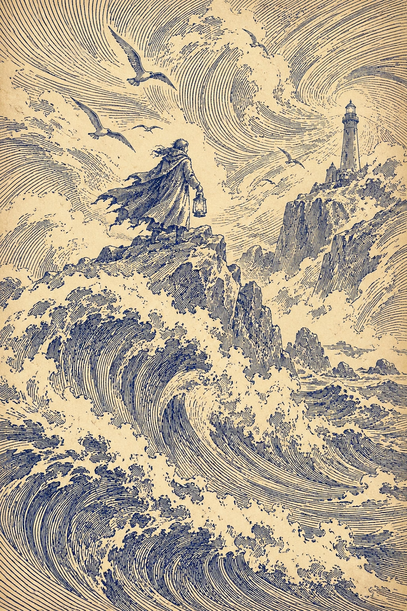
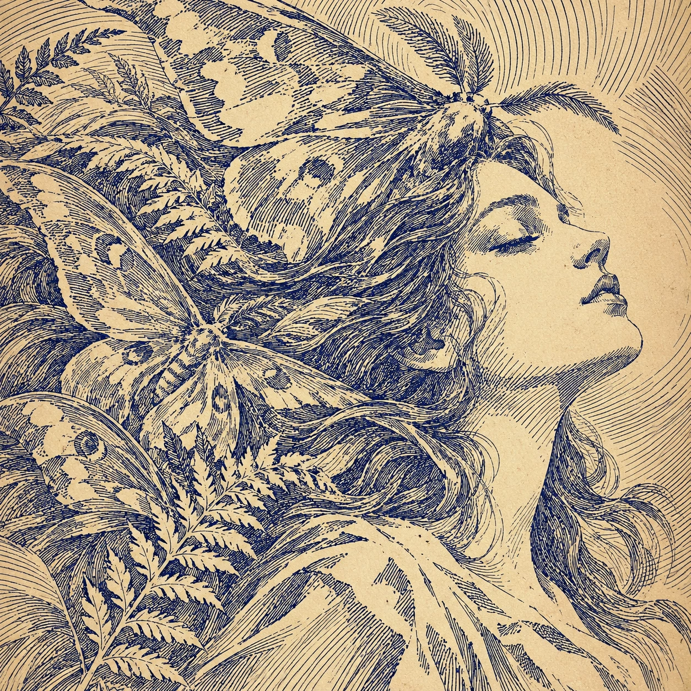
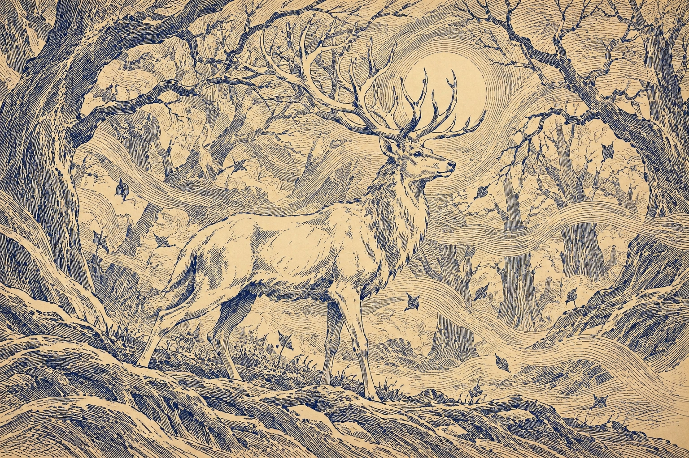
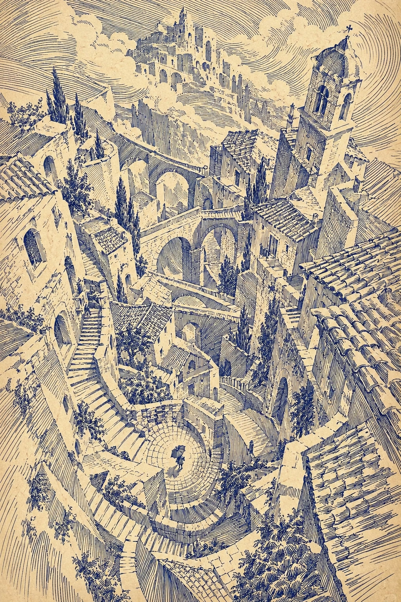
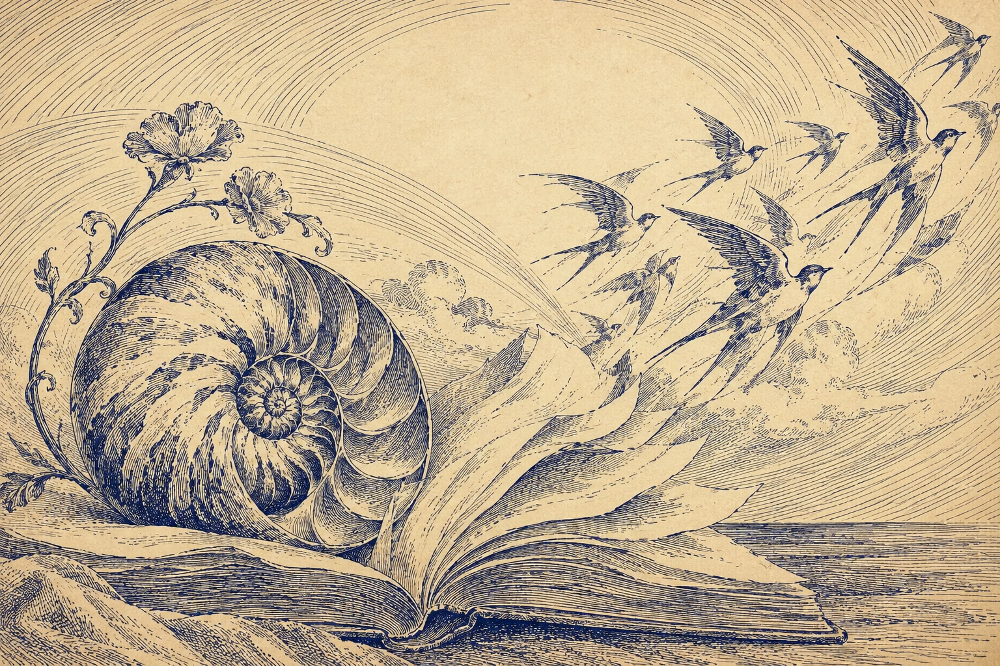

# 例图索引与视觉分析

五张均为本次工作流生成的示例（2026-10-05，内置 image_gen），从用户提供的两张参考图中抽象视觉特征，再换主题、换构图生成。这里不附用户上传的原参考图。随包提供保留原尺寸的 WebP，便于预览、安装和作为生成输入；PNG 原件未重复放入安装包。

每次任务至少打开两张查看，不以阅读文字或看到 Markdown 链接代替视觉观察；至少一张须进入生成工具的图片参考输入。可迁移部分是线条、纸色、留白和空间组织，主题仅为示范。

## 01 守潮人：环境与尺度

人物在左侧岩石上，灯塔在远处右侧，前景海浪占较大面积。流动长弧连接水与风，岩石转用短折线束，披风沿褶皱加密。可借鉴大小对比、对角线纵深和材质分工，不必沿用提灯与灯塔。

## 02 蛾之梦：近景与疏密

侧脸额头与面颊留纸，眼窝、鼻底和颈部局部排线；左侧发丝、蛾翼和蕨叶密集，各有方向。可借鉴近景裁切、明暗相邻与有机形体交织，不把蛾固定为肖像配件。

## 03 林间白鹿：横向与框景

两侧树干建立暗框，鹿身体相对疏，鹿角伸入枝丫。地面与雾带横向流动，月周弧线提供另一节奏。借鉴主体通过线密度脱离背景、横幅层次与形状呼应。雾带可选，避免每张都加同样丝带。

## 04 螺旋之城：几何与俯视

石阶向下盘旋，屋瓦、墙面和桥洞以不同方向排线划分。微小撑伞者提供尺度，曲线街道与直线建筑面互相支撑。借鉴复杂空间中的焦点、曲直对比与重复结构；仍须检查透视，不以奇幻为理由忽略意外错接。

## 05 贝壳与飞鸟：静物与留白

左下贝壳与书本较重，右上飞鸟渐轻，书页连接两者。壳体、薄纸、羽毛和木面有不同排线语言。上方安静纸面平衡下方细节。借鉴对角线展开、静物尺度与变形过渡，留白可以更大，环境线不必铺满。

## 选图建议

| 当前任务 | 首选 | 补充 |
|---|---|---|
| 人物、肖像 | 02 | 01 或 05，尺度/留白 |
| 动物、森林、植物 | 03 | 02，有机轮廓 |
| 建筑、街景 | 04 | 01，空间深度 |
| 风、水、云、山 | 01 | 03，框景与疏密 |
| 静物、诗句、抽象意象 | 05 | 02 或 04，曲直对比 |

没有对应主题时，按需要借鉴的排线方式选图，不强行换成例图题材。
