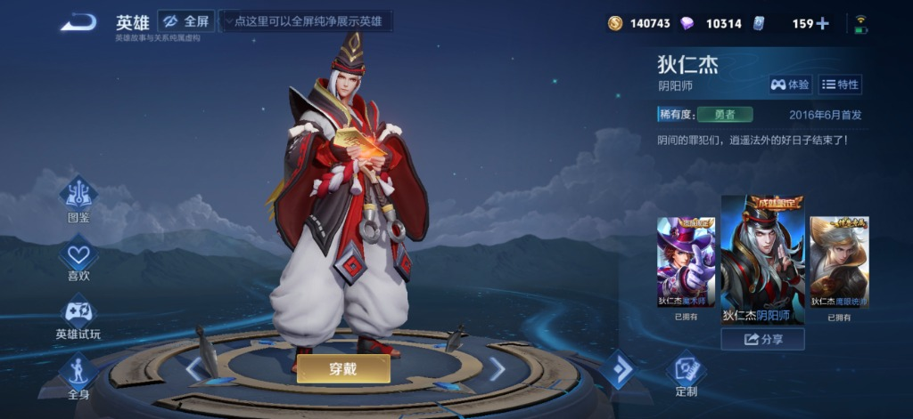
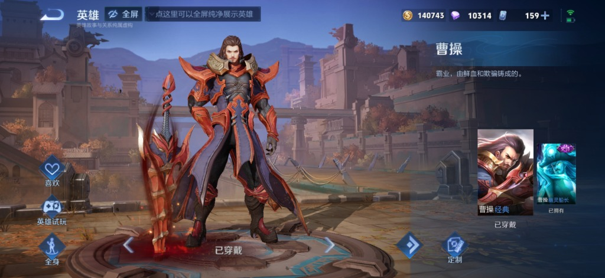
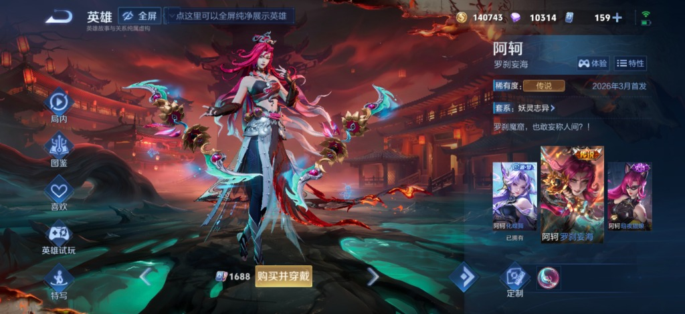

# 王者荣耀 × 经典动漫联动皮肤提示词生成器 (hn-hok-skin-prompt)

## 核心定位

本 Skill 专门用于生成**高精度、次世代手游 3D 建模质感、官方 16:9 真机展台 UI 对齐**的《王者荣耀》经典动漫联动皮肤生图提示词。

用户**只需要给出一个人物**（例如：“卡卡西”、“索隆”、“诸葛亮”、“五条悟”），Agent 即可全自动完成英雄契合度匹配、服装道具深度融合设计、纯净背景留白规划、官方全套 UI 参数填充，并生成可以直接复制给作图工具（ChatGPT、Midjourney 等）使用的完整提示词以及配套的小红书极简发布文案。

---

## 📸 原始真机例图是本技能的视觉基准 (Mandatory Visual References)

本 Skill 必须随包携带用户提供的 **3 张原始真机全屏截图**（存放于 `assets/examples/`，元数据记录在 [references/examples.json](references/examples.json)）。生成提示词与视觉评估前，必须以这 3 张真机截图作为人设比例、画风、空间留白与 UI 的绝对对齐标尺：

| 必需真机例图 | 角色与皮肤 | 用来校准什么关键特征 |
| :--- | :--- | :--- |
|  | **狄仁杰 · 阴阳师** | **黄金站位与留白**：角色居中偏左 40%，全身完整不切脚，脚踩同心圆发光地台；大面积深蓝星夜山峦与河流纵深留白；顶部资产栏与右侧信息排版。 |
|  | **曹操 · 经典** | **武器比例与气场**：重型大剑斜立姿态；古都秋色城郭深远景深、开阔天空留白；地台中央金色“已穿戴”按钮与左右切换箭头。 |
|  | **阿轲 · 罗刹妄海** | **传说限定全套 UI**：全套动态服饰与双刺兵刃；“1688点券 购买并穿戴”价格操作按钮；右下角定制图标与已有皮肤横排卡片流。 |

> **校准原则**：
> 1. 生成前建议用图像查看工具打开 `assets/examples/direnjie-yinyangshi.jpg` 或对应例图，确保理解真实官方截图的留白空间与人物比例。
> 2. 严禁用文字二次元插画或胸像大头照替代；所有生成的提示词必须强制输出如同这 3 张真机截图般的整体效果。

---

## 必读参考文件

- `references/prompt-formula.md`：核心生图提示词母版与各个槽位的详细填充规范。
- `references/hero-matching-matrix.md`：动漫人设原型与王者荣耀英雄立体契合度匹配矩阵。
- `references/case-examples.md`：已通过 55 套实战验证的 5 组金牌经典案例（圣斗士、浪客剑心、钢炼、JOJO、EVA）。
- `references/examples.json`：3 张原始真机截图的尺寸、哈希与教学分析。

---

## 五大不可违背的视觉铁律 (Core Inviolable Principles)

每次生成的提示词必须严格灌注以下五项核心准则：

1. **16:9 展台与 40% 偏左黄金比例构图**
   - 画面严格保持 **16:9 横屏**《王者荣耀》官方手游全屏截图视角。
   - 角色居于**居中偏左（约 40% 横向位置）**，为右侧官方 UI 面板留出充足空间。
   - 角色**全身完整呈现**（从发顶发型到脚下鞋靴，**绝不可裁切双脚**），高度约占屏幕 65%。
   - 头顶上方必须拥有极其开阔通透的**纯净天空/大面积背景留白**（占比约 20%）。
   - 脚踩悬浮的经典金属同心圆发光英雄展示地台，底座中央金色“穿戴”或“购买并穿戴”按钮。

2. **极致纯净画风与极简质感（坚决杜绝粒子与杂光）**
   - 画面整体必须追求高级通透、干净利落的空间感。
   - **绝对禁忌**：漫天飞舞的繁杂粒子光尘、漂浮光斑、浓重噪点、刺眼炫光、混乱碎块。
   - 仅保留利落的人物剪影、高级柔和的环境光照，以及极简内敛的武器冷芒或法阵光轨。

3. **英雄本体与动漫角色的双重深度融合**
   - **角色必须是王者荣耀英雄本尊**！保留王者英雄标志性的五官轮廓与神韵气质（如李白的洒脱剑侠容颜、诸葛亮的清逸深邃、司空震的冷峻霸气、露娜的清冷神性），绝不能退化为单纯的卡通动漫角色截图。
   - 在王者英雄的高精 3D 人体模型上，精准融入动漫角色的经典服饰、配色、徽记或标志性配件。

4. **武器与标志性招牌姿态**
   - 动作必须体现该角色的灵魂招式或经典静止站姿（如拔刀居合蓄势、双手合十触地、压低帽檐、单手抚剑）。
   - 动作利落挺拔，气场沉稳内敛。

5. **全套官方真机 UI 完整覆盖**
   - 顶部栏：金币、点券、网络延迟图标；
   - 左侧功能列：模型/海报切换、定制、分享按钮；
   - 右侧信息面板：大号粗体英雄名、皮肤名、金色限定胶囊标签【经典联动·限定】、专属语音台词引号、横排已有皮肤卡片行以及右下角金色定制/购买按钮图标。

---

## 工作流 (Workflow)

当用户输入人物时，执行以下 4 个阶段：

### 阶段 1：智能人设解析与匹配
- **若用户输入动漫人物**（如“杀生丸”）：根据 `references/hero-matching-matrix.md` 自动匹配气质、战斗机制最契合的王者英雄（如“司空震”），并说明匹配理由。
- **若用户输入王者英雄**（如“李白”）：推荐最契合的动漫角色（如“奇犽”或“绯村剑心”）。
- **若用户同时给出了双方**（如“李白 索隆”）：直接采用用户指定组合。

### 阶段 2：定制皮肤档案生成
规划该联动皮肤的核心信息：
1. **皮肤名称**：`英雄 · 角色（副标题·核心视觉特征）`，例如：`李白 · 索隆（三刀流修罗·极意黑刀）`
2. **英雄定位**：刺客 / 战士 / 法师 / 射手 / 辅助
3. **皮肤标签**：`经典联动·限定`
4. **限定售价**：1788 点券
5. **经典台词**：提炼动漫灵魂金句（15~25 字）

### 阶段 3：装配完整生图提示词
将提取好的设定填充进 `references/prompt-formula.md` 的母版中，生成可以直接复制使用的完整生图提示词代码块。

### 阶段 4：生成小红书极简发布文案
按照成熟的小红书发布规范，配套生成极简文案：
- **标题**：短小精炼（如 `王者荣耀×海贼王 联动皮肤`）
- **正文**：1~2 句话（点出品质亮点），并附带 `（注：本组图片为AI作图 / 概念设计）`
- **标签**：精选 5~7 个核心话题标签

---

## 输出格式规范

每次响应时，请按以下结构整洁呈现：

```markdown
### 🎮 联动皮肤概念设定
- **英雄 × 联动角色**：{{HERO}} × {{ANIME_ROLE}}（来自《{{ANIME}}》）
- **皮肤全名**：{{TITLE}}
- **定位与标签**：{{HERO_CLASS}} ｜ 【经典联动·限定】（1788点券）
- **专属语音台词**：“{{QUOTE}}”
- **设计看点**：简述英雄五官保留重点、服装道具融合点与纯净背景构想。

---

### 🎨 完整生图提示词 (可直接复制作图)

```text
[此处输出填充完整的提示词内容]
```

---

### 📕 小红书极简发布文案 (一键复制)

**标题**：王者荣耀×{{ANIME}} 联动皮肤
**正文**：
{{1~2句话正文介绍}}
（注：本组图片为AI作图 / 概念设计）
**标签**：
#王者荣耀 #{{ANIME}} #{{HERO}} #{{ANIME_ROLE}} #AI做图 #AI绘图 #游戏皮肤
```
