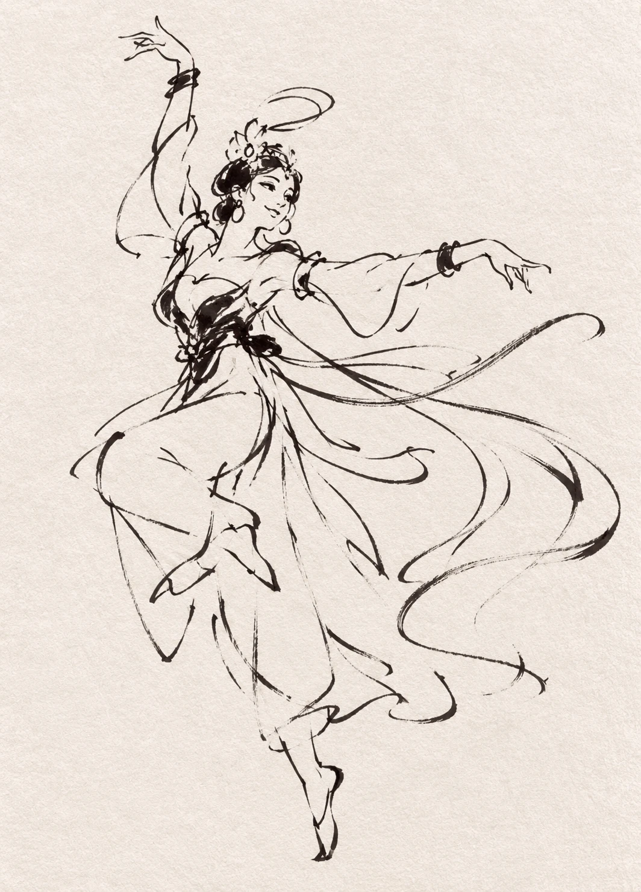
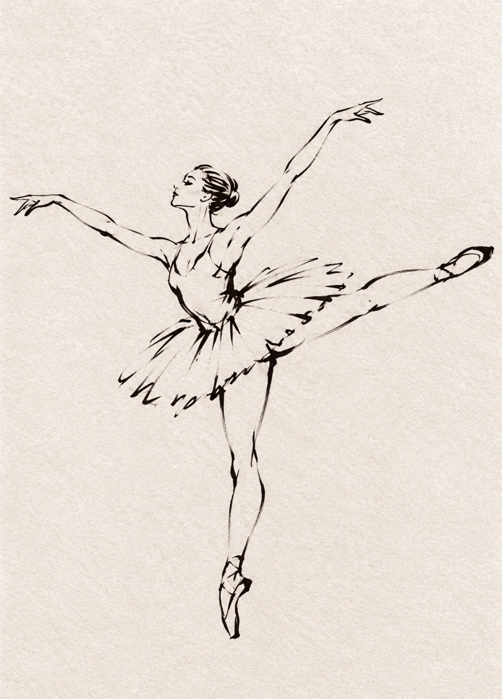
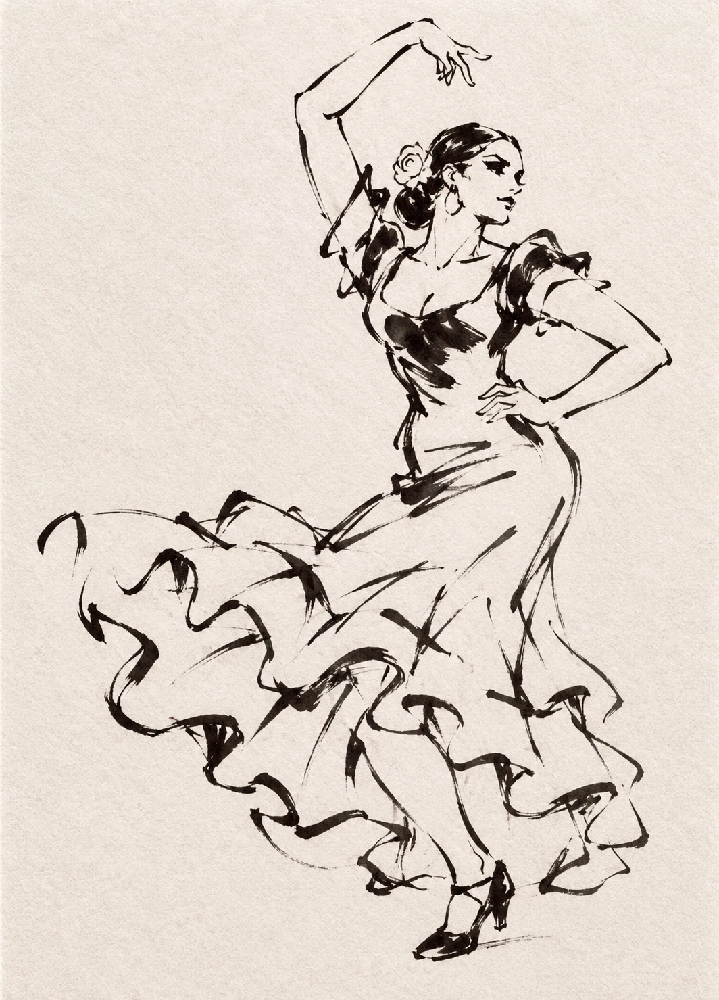
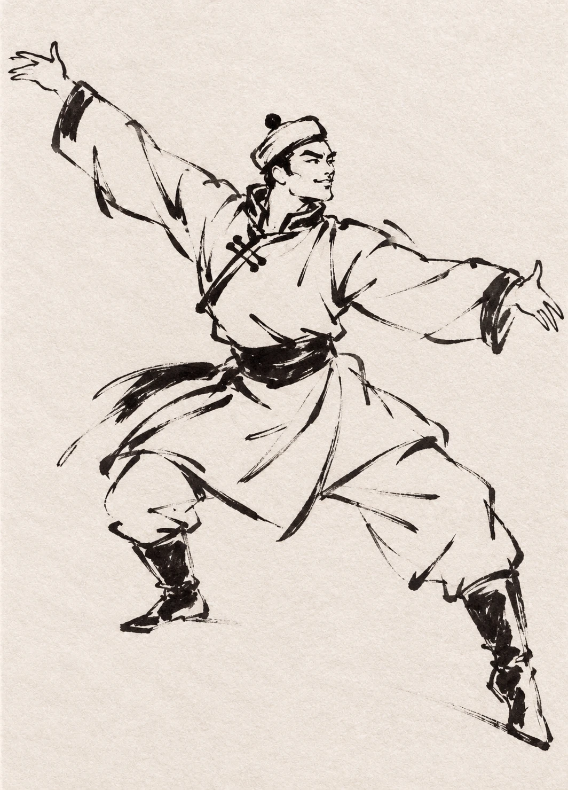
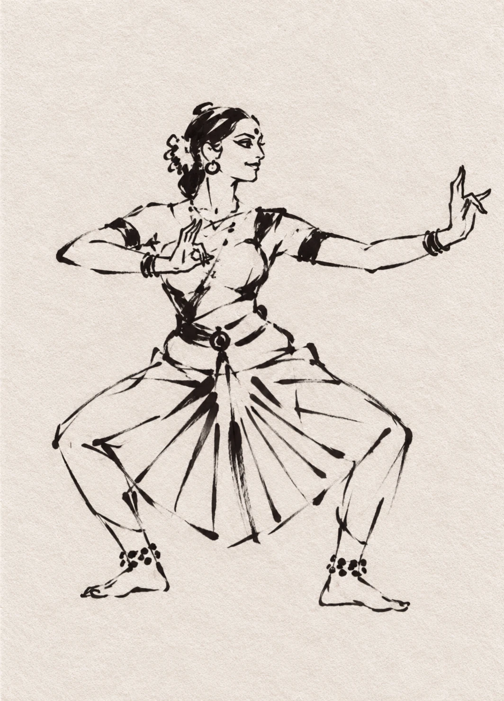
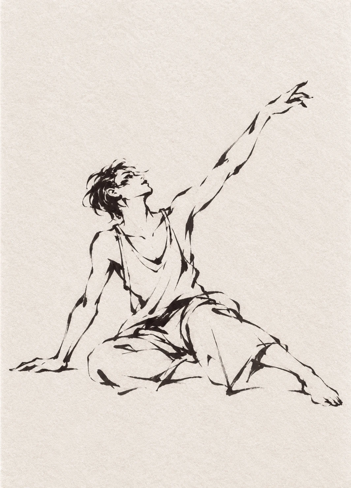

# 必读例图库

这些例图展示共享的墨线语言与不同的主体结构。它们不是六种彼此独立的画风，也不是必须复制的角色。必须实际查看图像，按 SKILL.md 的要求选取视觉参考。

## 01 · 扬袖：笔触与动势基准

观察黑发与腰间浓墨如何锚定疏松轮廓，裙摆与飘带如何形成连续动势。该图是线条参考，不是默认服装；其装饰和衣褶也处于本风格较密的一端，可以进一步删减。

## 02 · 芭蕾：伸展与轻线

短硬纱裙、紧身舞衣与足尖鞋形成轻薄轮廓。水平伸腿与垂直支撑腿构成明确方向。不要把短裙改成长袍；用少量断续线保留身体的延伸。

## 03 · 弗拉门戈：踏步与裙摆节奏

贴身上身、弯曲手臂和下摆荷叶边形成浓缩而有力的节奏。裙摆的弧线与芭蕾短裙不同；花与耳环只需点到为止。

## 04 · 蒙古舞：展臂与厚重衣料

长袍交襟、腰带、宽裤、靴子与低重心宽站姿建立厚实轮廓。几处粗墨提供力度，衣料不必靠飘带表现运动。

## 05 · 印度古典舞：角度与扇形褶布

外开屈膝、角度明确的手臂、简化手势和两膝间扇形褶布构成几何节奏。踝铃概括成少量墨点。此图是艺术化速写，不作为舞种服饰或技术教学资料。

## 06 · 现代舞：地面与收缩

背心、宽裤、短发、赤足和单手撑地改变了整体轮廓与高度。对角伸臂和紧凑腿部形成张力；上方留白不需要用飘带或装饰填满。

## 来源与随包要求

六图均为本次对话中通过 image_gen 生成的作品，已于 2026-10-06 转为保留整幅画面的 WebP，用于轻量分发；没有裁切或改绘。用户最初上传的三张参考图不随仓库公开分发。生成过程借鉴其疏放墨线、舞蹈动势和暖色纸感；这里不作作者、年代或权属声明。

| 文件 | 原始生成文件 |
| --- | --- |
| 01-ink-ribbon.webp | exec-805cdec8-6870-4de5-87e9-96be6267a910.png |
| 02-ballet.webp | exec-2a83b622-594a-4222-8628-0cae6aab87c2.png |
| 03-flamenco.webp | exec-186113e0-0d90-4570-b7c7-75e0d8f5d7dc.png |
| 04-mongolian.webp | exec-d6fd9e86-33a5-458b-9945-5ee3a9d135ef.png |
| 05-bharatanatyam.webp | exec-9dd6cccf-49bc-4b0b-b46a-798eb18d88ee.png |
| 06-contemporary.webp | exec-2a21685f-3eee-47ef-b848-bce52e872d01.png |

`references/examples/` 内六个文件必须与此文档一起存在。不要把本机绝对路径写入提示词或改成依赖远程链接的例图。
