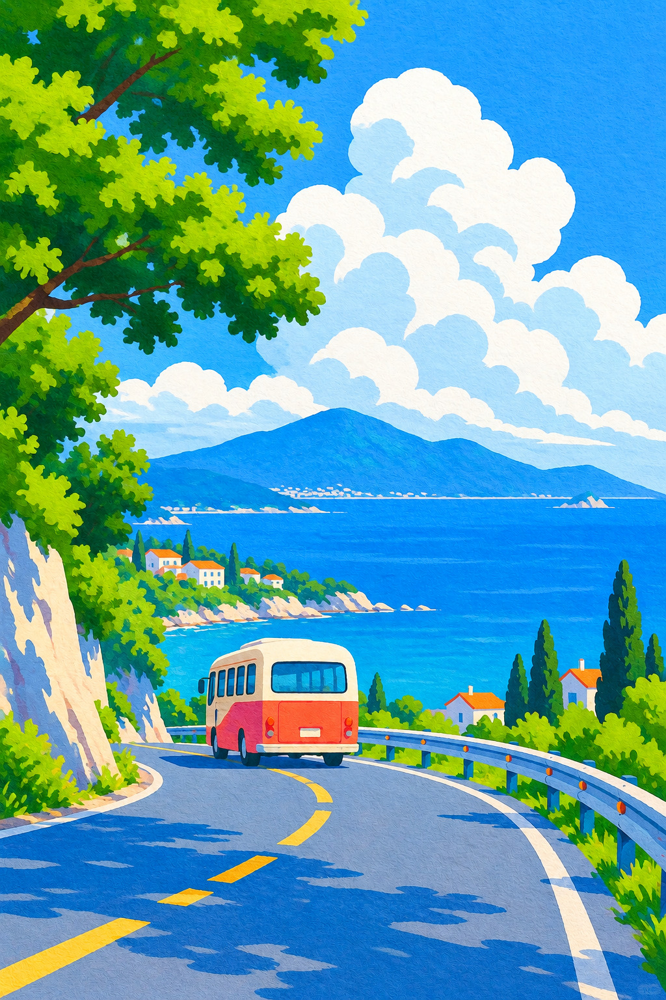
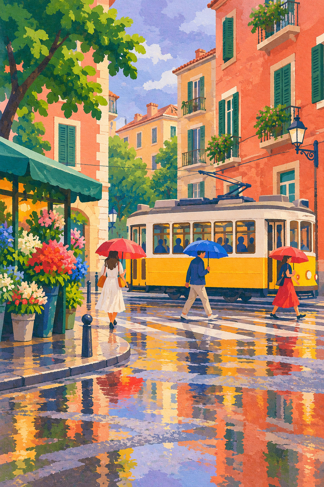
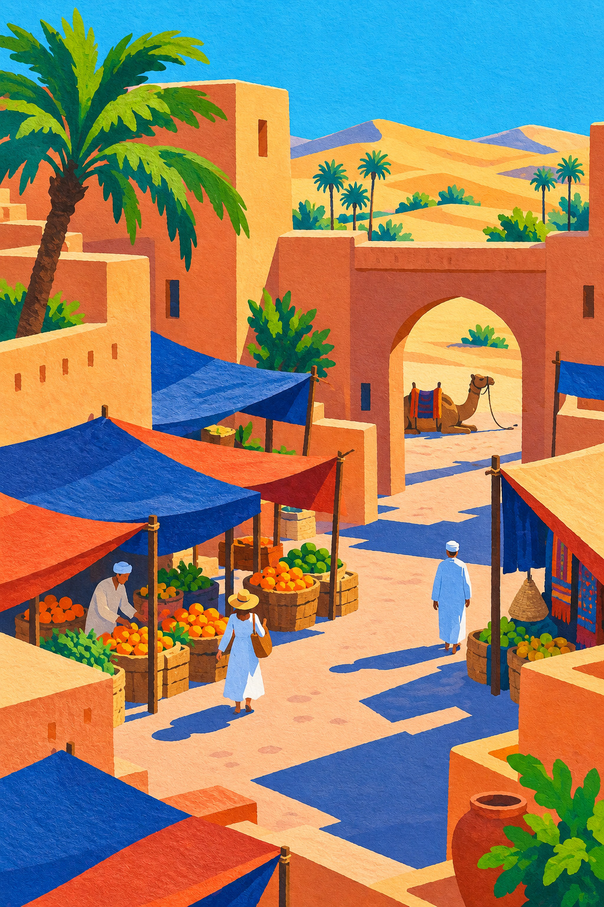
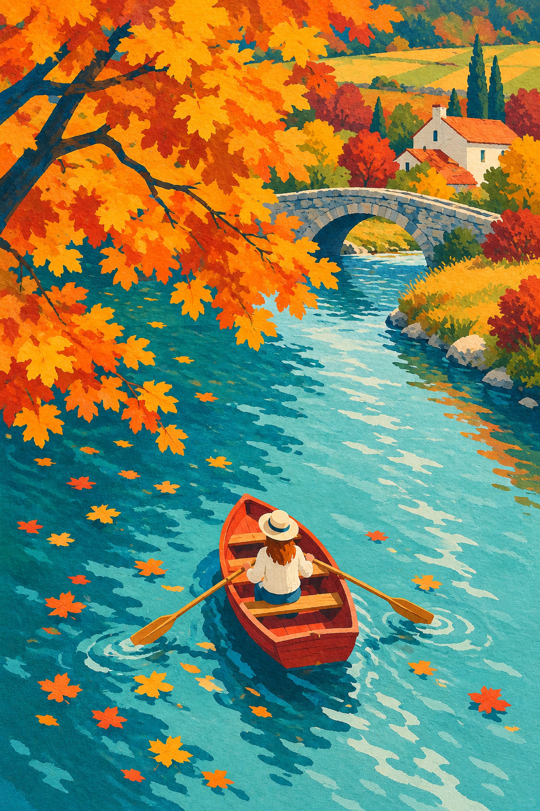
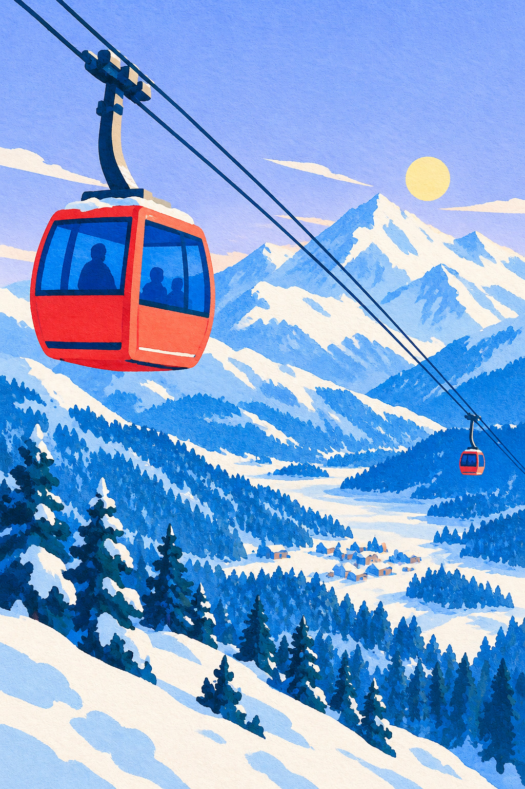
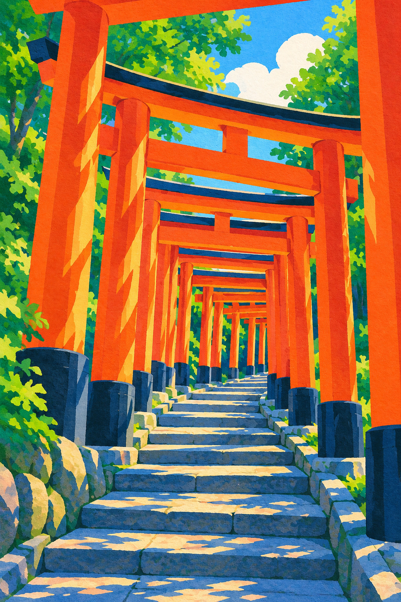

# 必读视觉例图

这六张图是本技能的视觉基准，均为本项目实际生成的独立作品，完整保留 1024×1536 画面，以高质量 JPEG 随技能分发。不是占位图、远程链接或裁切联系表。来源、尺寸和 SHA-256 见 [manifest.json](../assets/examples/manifest.json)；从技能根目录解析其中的 `path`。

## 海岸巴士：基础锚点

蓝色海面和天空仍有细纸纹；云用白色、浅青色两个主要面；树冠以黄绿和深绿色块搭建；路面投影为独立蓝块。借用材质、边缘和空间语言，不把海岸、公路或巴士固定为所有作品的内容。

## 雨后电车：城市和阴天气候

灰紫天空、珊瑚色建筑和黄色电车仍保持清爽对照；湿地倒影是破碎色块，不是镜面写实。比基础锚点更细密，但建筑大轮廓始终先于花卉细节。适用于街区、生活场景和雨后题材。

## 沙漠集市：暖色主导

赭黄、陶土色构成建筑和沙丘，靛蓝投影与遮阳棚负责冷色对照；拱门和斜向棚布组织深度。强调色可以是蓝色，而非每幅都用橙色。适用于沙漠、庭院、集市和暖色建筑。

## 秋日划船：少天空、俯视构图

橙色树冠与青色水面构成两大色域；木船成为焦点；河流把近景与石桥连接。无需蓝天或云朵证明风格。适用于秋季、湖河、森林和俯视场景。

## 雪山缆车：冷色、白色负形

雪山由白与蓝的面组成，松林简化成节奏；红色缆车集中焦点，缆线形成斜向深度。白色也保留纸纹，避免光滑 CGI 雪面。适用于山地、雪景、空中视角和交通主题。

## 伏见稻荷：地标与重复形状

朱红鸟居与青蓝柱脚、阴影形成明暗节奏；近大远小的结构把视线引入画面。保留可辨识的鸟居结构，不用写实照片，也不靠文字标签标认地点。适用于建筑空间、廊道、阶梯和地标。

## 选择输入参考

每个新任务实际打开基础锚点、目标近邻、不同配色或视角的一张，完成至少三张的观察，批量内复用已看过的图。生成时通常只输入基础锚点和目标近邻，并明确标为风格参考。六张都输入可能混合多个场景，不是必需操作；用户内容参考另标角色。

共同点是材料、块面、边缘和简化程度；场景差异是技能可迁移的关键。这是视觉范围，不是复制某张图的配方。
