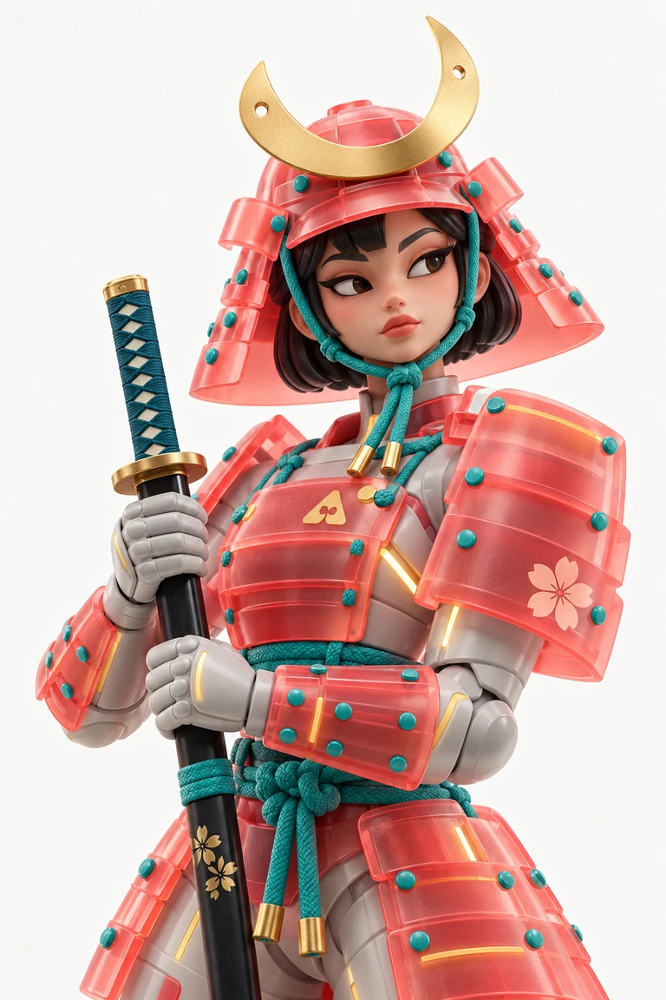
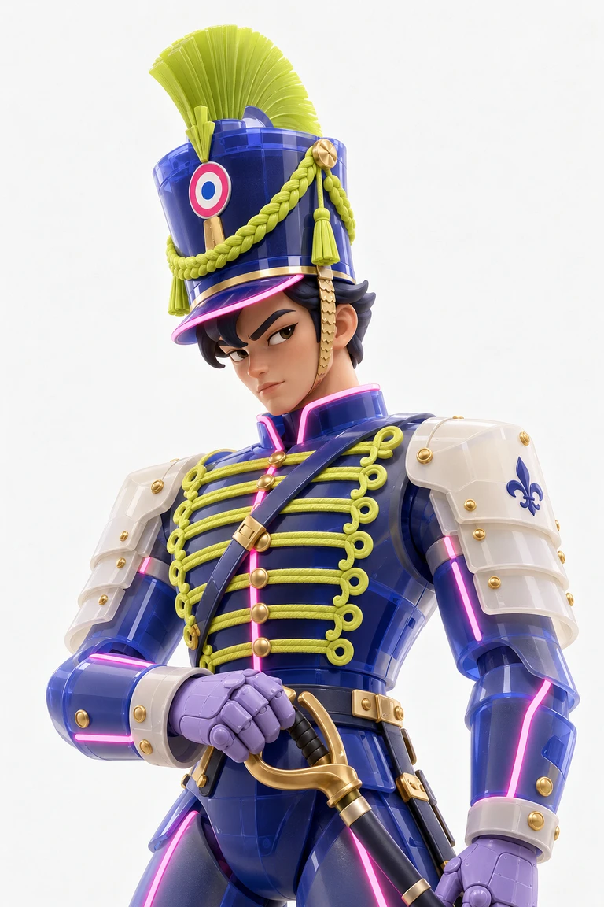
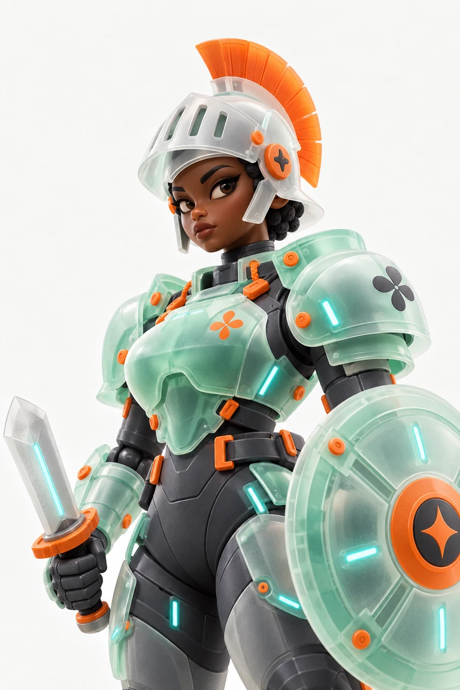
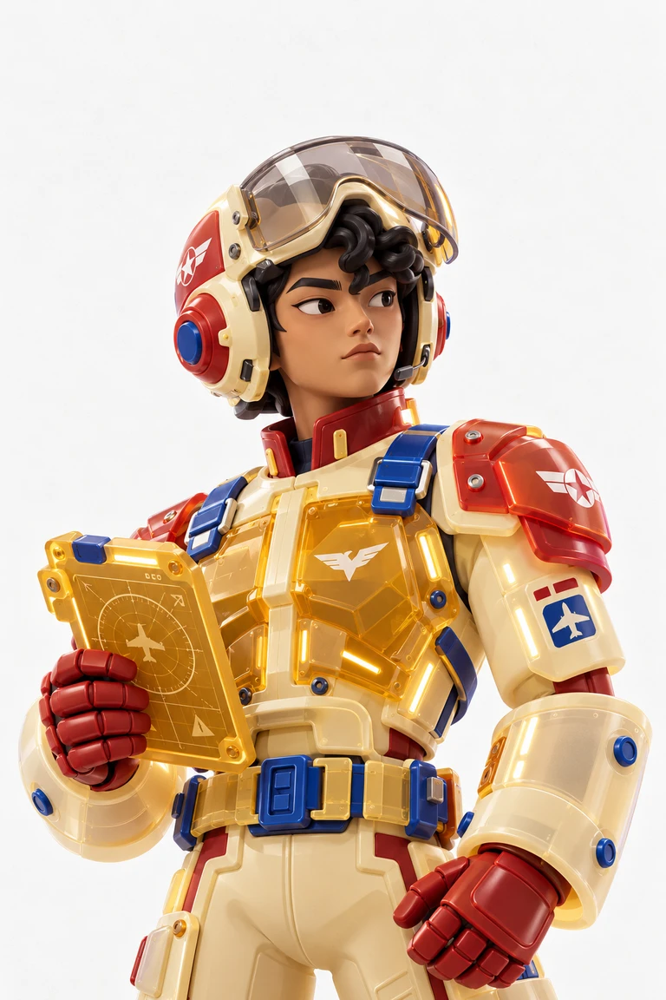
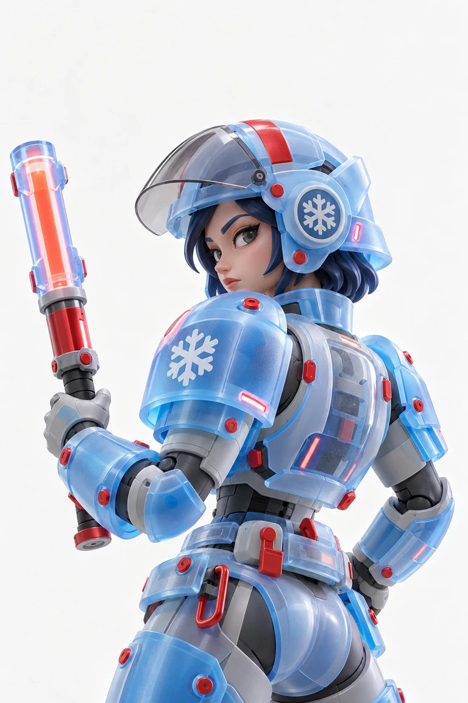
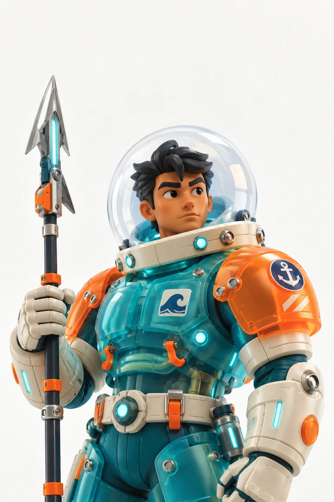

# 半透明制服玩具

把人物与服装一起设计成精致的 3D 收藏玩具：**卡通雕塑人物 + 硬挺制服/盔甲 + 有厚度的半透明树脂壳**。变化角色、时代与颜色，保持这三个核心。用户的明确要求优先于本技能默认值。

## 例图是技能的必需组成

必须保留并随安装分发 `assets/examples/` 的实际图片及 [references/examples.json](references/examples.json)。不能用网页链接、文字描述或失效占位图替代。以下均为本项目生成的独立例图，不是模板作者的原始参考图。

生成前：

1. 将本文件所在目录作为 skill 根目录；检查清单与其引用的图像文件可读。
2. 用可用的图像查看工具打开 **samurai-coral.webp、hussar-indigo.webp、knight-mint.webp** 三张基础例图。只读 Markdown 或文件名不算已看图。
3. 飞行、极地、潜水或同类装备再查看对应专项例图；对用户上传的参考也先实际看图。
4. 把基础例图理解为人物与材料参考，把专项例图理解为轮廓参考。用户有角色或配色要求时照做，不把例图的脸、姿势、头盔、配色或道具锁死。

必需资源缺失时，报告缺少的相对路径，先恢复完整技能包；**不能声称已参考例图继续生成**。如果用户明确授权只依据文字继续，则说明此次没有完成例图校准。

| 必需例图 | 用来校准什么 |
| --- | --- |
|  | 卡通眼眉、雕塑头发、珊瑚红透明分层甲与青色绳饰 |
|  | 高帽与硬挺制服、荧光黄绳饰、粉色嵌入灯线 |
|  | 圆厚肩甲、橙色扣件、关节手套与透明圆盾 |
|  | 大色块制服、透明琥珀胸甲与刚性专业装备 |
|  | 背面回首构图、透明背甲中的内层结构 |
|  | 球形透明罩、硬壳体积与机械连接件 |

清单包含每张图的用途、配色、尺寸与 SHA-256，便于确认例图完整安装。

## 不变的风格骨架

- **人物是玩具。** 稍大的眼睛与头部，简化鼻唇、图形化眉毛、成束雕塑头发；平滑哑光或缎光 vinyl 皮肤。保留成熟角色的表情与体态，默认约 1:6 头身，不自动变成幼儿大头公仔。避开毛孔、真实皮肤细纹与摄影模特脸。
- **服装有硬结构。** 护胸、肩甲、头盔、袖口、护裙或制服衣身像模压零件，轮廓稳定；采用厚边、翻折、铆钉、扣件、层叠甲片、关节和少量装配缝。绳饰、披肩等可作为配件，但不能把主服装变成柔软纱衣。
- **透明来自材料。** 大片磨砂染色半透明树脂与局部清透塑料组合，边缘更清亮，叠层处加深；透过外壳能隐约看见内搭、连接件或内部结构。保留壁厚、折光、微细磨砂颗粒与柔和高光，避免全透明玻璃人、普通发亮金属或软绵绵薄膜。
- **配色有层级。** 每个角色通常一至两种大面积主色，搭配小面积撞色与少量中性色。可参考珊瑚红/青绿、靛蓝/柠檬黄、薄荷绿/橙、奶油黄/红、蓝/淡紫；这些是关系示例，不是唯一色盘。贴纸与灯线只作为点缀。
- **画面像棚拍公仔海报。** 默认竖版 2:3，暖白纸纹底、柔和棚光、适度接触阴影；单个角色以清晰轮廓为主。保留呼吸空间，避免拥挤背景。严格的留白比例、全身或半身、透明背景均以用户用途决定。

## 生成与系列变化

先明确用户给出的角色、数量、用途和配色；未指定的部分自行做合理设计，不重复确认已经给出的信息。

- 实际生图默认使用可用的内置 `image_gen`。把已查看的 2–3 张最相关例图作为 **style/material references** 传入 `referenced_image_paths`；明确不是身份或内容复制目标。有用户参考时优先使用，并把总参考数控制在工具支持范围内。
- 每张独立角色使用独立提示词和调用；不能用一张联系表或同一人物换色冒充多张。调用数等于用户要求的独立作品数；不默认生成 20 张，也不强制使用 subagent。
- 系列至少从角色职业/时代、制服轮廓、主辅色、头饰与装备、姿态/视角中改变两项。保留共同的人物抽象程度和材料逻辑，避免所有角色都重复高帽、佩剑、同一脸或同一站姿。
- 默认不加品牌字样或大段文字；用户需要编号或标识时按要求添加。用少量图形贴花丰富服装，但不要复制例图的特定徽标。
- 仅要求提示词时，给出明确可执行的提示词，不擅自生图。需要作图时不要只交设计说明。

编写提示词时读取 [references/prompt-recipes.md](references/prompt-recipes.md)，用公共风格锚点与本次角色规格组合，不照抄整张例图的内容。

## 看图验收与交付

实际查看输出再确认：人物是否明显卡通；制服是否硬挺；透明壳是否有厚度、透色和内层细节；关节与道具是否合理；系列是否有角色和配色变化。若偏成真人或软纱时装，针对该偏差重写约束后修改；未经用户追加范围不无限扩充张数。

把最终图保存到用户指定或当前项目的交付目录，同时保留实际提示词与编号/角色说明。交付作品数量、路径和生图模式。网站制作、账户写入或发布是独立任务，本技能不会自动授权这些动作。
