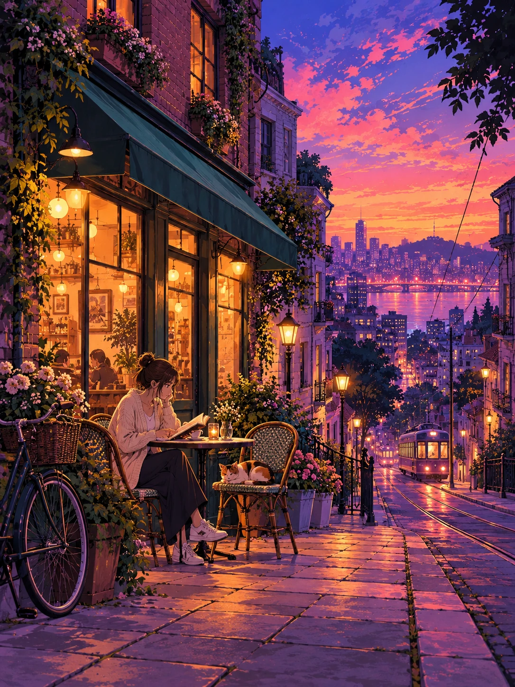
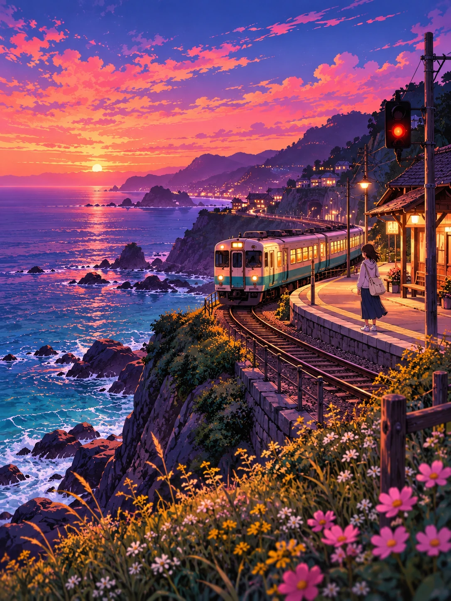
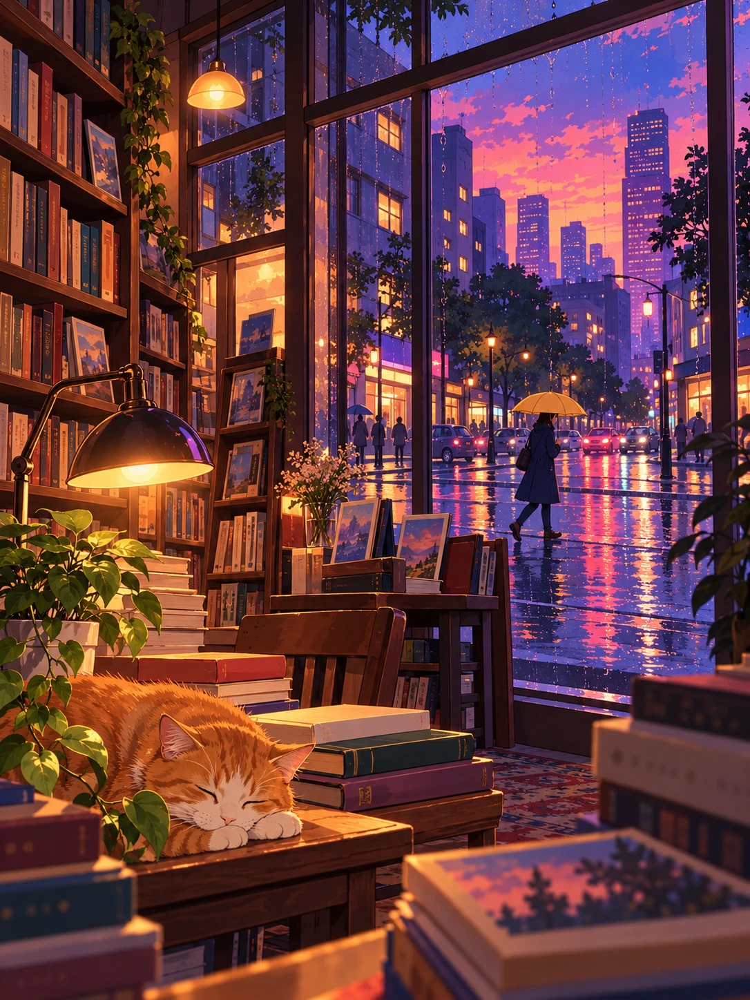
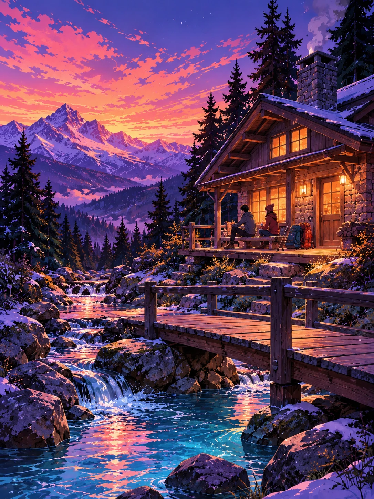
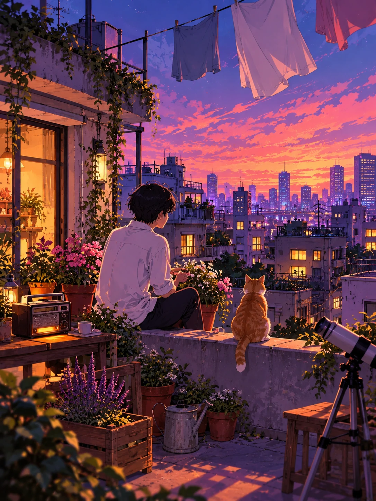

# 例图与视觉校准

五幅均来自本次对话生成的独立图像，原始尺寸1086×1448。技能随附同尺寸WebP，仅做格式压缩，不裁切、不重绘。它们是必读视觉示范，不能从安装包删除。

观察时先找共有的表现方式，再看题材差异。传给生成工具时注明“风格参考”，避免照搬布局和物件。

## 01 街角咖啡馆

左侧近景绿篷、花叶和琥珀窗灯，右侧坡道引向冷紫城市。砖墙与石路的绘画纹理、细线透视构成环境质感。读书人物、邻座猫、自行车和远处电车提供小型叙事。借鉴街道纵深、暖光落到人物与桌面、繁密细节中的清晰焦点，不必复制咖啡馆或猫。

## 02 海边列车

海面和天空形成开阔空间，弯轨把列车与右侧候车人物连接起来。青蓝海水、粉橙反光、靛紫礁石与暖车窗延续冷暖关系。花草、岩岸、山岬层层递进。借鉴宽景中的小人物、动态物体与安静环境的平衡，不必固定铁路。

## 03 雨夜书店

室内台灯、木书架、纸张与睡猫偏暖，窗外街道偏冷。窗框与雨滴分隔内外，湿路面映出粉紫光线。黄色雨伞为中景焦点，书与猫为近景锚点，城市在远景。借鉴框景、内外冷暖关系和纸木质感，画面不靠整片天空成立。

## 04 山间旅舍

旅舍的局部暖光与大面积蓝紫雪山、针叶林相对。桥与溪流从前景引向门廊，人物只是风景中的安静活动。雪、岩石、流水、木材各有不同纹理与反光。借鉴自然环境中的光源可信性、溪流引导与尺度感，不必出现雪山。

## 05 屋顶晚风

人物与猫占据近景，晾衣绳、花盆、收音机和望远镜让空间有人居住。建筑高低错落，窗口暖光散在远景，紫色阴影维持秩序。白衬衫与白布反映环境照明。借鉴生活物件组织、局部动作和背侧视角，不必复制性别、猫或屋顶。

## 跨图结论

共有的是配色关系、精细环境线条、手绘表面、可信暖光、前中后景和安静情绪。街道、海岸、室内、山地、人物近景可以完全不同。猫、花草、粉云与城市不是必选对象，与用户题材无关时应舍弃。
